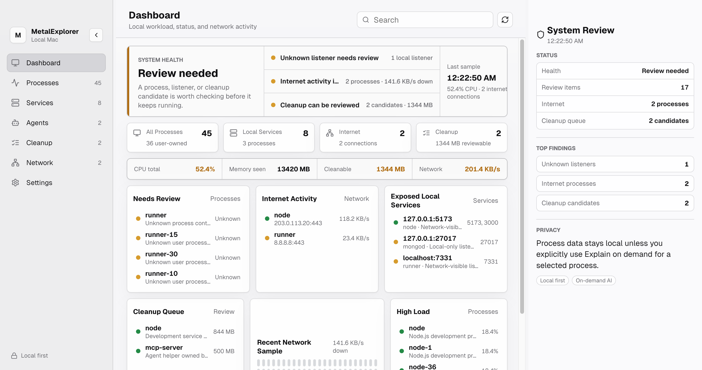

# MetalExplorer

> A macOS task manager for the agent era. See every process, local server, AI agent, and internet connection with plain-English explanations and guarded cleanup.


<p align="center">
  
</p>

MetalExplorer is for people who run local AI tools, MCP servers, dev servers, package scripts, databases, browser helpers, and background agents, then lose track of what is still alive.

Activity Monitor tells you that something is running. MetalExplorer tells you what it probably is, why it matters, whether it is talking to the internet, and whether it is reasonable to stop.

## Why this exists

Modern local development is no longer just `npm run dev` on one port.

AI coding tools start helper processes. MCP servers stay alive. Local packages bind random ports. Browser tooling spawns helpers. Some of it is useful. Some of it is stale. Some of it deserves a closer look.

MetalExplorer makes that visible without asking non-expert users to decode `lsof`, `ps`, `nettop`, or unclear process names.

## Highlights

- Dashboard for local workload, internet activity, cleanup pressure, and general health.
- Dense process table with CPU, memory, PID, user, uptime, category, description, ports, and network activity.
- Dedicated views for Processes, Services, Agents, Cleanup, and Network.
- Collapsible filters for kind, risk, and activity.
- Resizable left, center, and right panes with a collapsible icon-only sidebar.
- Process inspector with command, tags, ports, internet services, impact score, and uptime.
- Optional AI explanation through any OpenAI-compatible `/chat/completions` endpoint.
- Guarded termination for current-user processes that are likely safe to stop.
- Local-first settings, dark mode, and Matrix theme.

## Safety model

MetalExplorer is intentionally conservative.

- It reads process and network state from standard macOS tools: `ps`, `lsof`, and `nettop`.
- It does not install a daemon, kernel extension, login item, browser extension, or network proxy.
- It does not require admin privileges.
- It sends `SIGTERM`, not `SIGKILL`.
- It blocks termination for PID 0, PID 1, root-owned processes, obvious macOS system paths, and MetalExplorer itself.
- It does not send process data to AI unless you click `AI Explain`.
- API keys stay in memory by default. If you enable "Remember key locally", Electron `safeStorage` is used when available.

Read the full safety and privacy notes:

- [Safety and Privacy](docs/SAFETY_AND_PRIVACY.md)
- [Architecture](ARCHITECTURE.md)
- [Security Policy](SECURITY.md)
- [FAQ](docs/FAQ.md)

## Install

Apple Silicon release builds are published on GitHub. They are ad-hoc signed and not notarized yet, so macOS may show an unidentified developer warning.

You can download the DMG here -> [MetalExplorer (Apple Silicon)](https://github.com/sethupavan12/MetalExplorer/releases/tag/v0.2.0)

If not, build locally:

```bash
npm install
npm run package:mac
open release/mac-arm64/MetalExplorer.app
```

Current packaging is Apple Silicon first. Intel or universal release builds should be added before a broad public launch.

## Development

Requirements:

- macOS
- Node.js 22.12+
- npm 10+

Start the app:

```bash
npm install
npm run dev
```

Run checks:

```bash
npm test
npm run build
npm run visual:smoke
```

Create local macOS package:

```bash
npm run package:mac
```

See [Development Guide](docs/DEVELOPMENT.md) for the project structure, scripts, and troubleshooting.

## AI configuration

Open Settings and provide:

- Base URL: `https://api.openai.com/v1` or another OpenAI-compatible base URL.
- Model: any chat-completions-compatible model exposed by that endpoint.
- API key: stored only in memory unless "Remember key locally" is enabled.

AI is optional. Without an API key, the local descriptions, categories, filters, and cleanup workflow still work.

## What is saved

Saved locally:

- Base URL
- Model
- Refresh interval
- Theme
- Pane sizes and collapsed sidebar state
- Remember-key preference
- Encrypted API key, only when explicitly enabled and supported by `safeStorage`

Not saved:

- Process history
- Network history
- AI responses
- Search history
- Termination history

## What can be sent to AI

Only when you click `AI Explain`, MetalExplorer sends the selected process details to the configured AI endpoint:

- Process name, PID, parent PID, user
- CPU, memory, uptime
- Local ports
- Local category and local description
- Command path and arguments
- Local safe-termination flag

Process command lines can contain secrets if another app was started with secrets in CLI arguments. Review [Safety and Privacy](docs/SAFETY_AND_PRIVACY.md) before using AI explanations on sensitive machines.

## Project structure

```text
src/main        Electron main process, macOS process parsing, settings, AI calls
src/preload     Typed IPC bridge exposed to the renderer
src/renderer    React UI
src/shared      Shared TypeScript contracts
tests           Vitest tests for parsing, classification, and AI parsing
scripts         Visual smoke test and renderer mock data
docs            Product, safety, launch, and contributor documentation
```

## Contributing

Issues and pull requests are welcome. For larger changes, open an issue first so the safety model and UI direction can be discussed before implementation work.

Start here:

- [Contributing Guide](CONTRIBUTING.md)
- [Development Guide](docs/DEVELOPMENT.md)
- [Architecture](ARCHITECTURE.md)
- [Roadmap](docs/ROADMAP.md)
- [Open Source Launch Playbook](docs/OPEN_SOURCE_PLAYBOOK.md)

## License

MIT. See [LICENSE](LICENSE).
