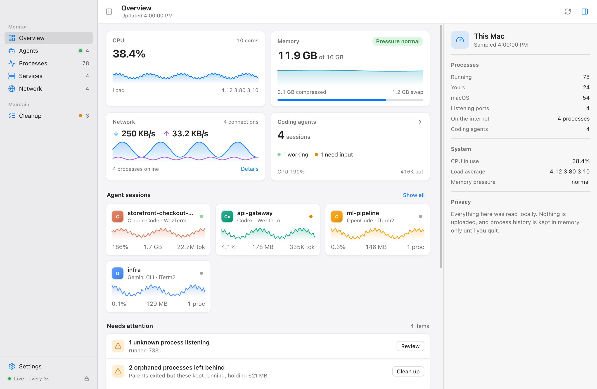
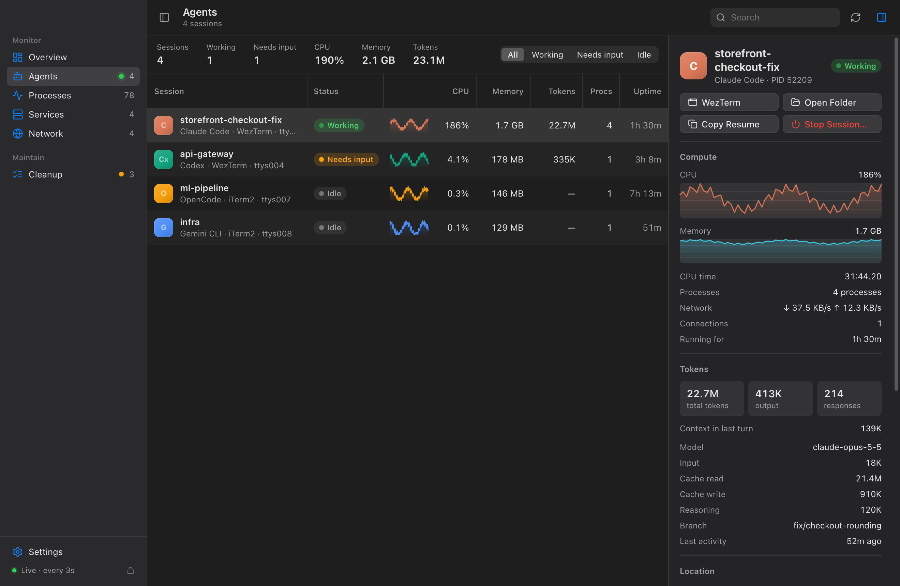

# MetalExplorer

> A native macOS activity monitor for the agent era. Watch every Claude Code, Codex, OpenCode, and Gemini session in one place, see what each one is burning, and clean up what they leave behind.


<p align="center">
  
</p>

If you run several coding agents at once, your Mac is full of processes you did not start by hand: test watchers, dev servers, MCP servers, headless browsers, language servers. Some belong to a session that is still working. Some were left behind when a session ended.

Activity Monitor shows a flat list of `node` and `claude`. MetalExplorer shows which terminal each agent lives in, what its whole process tree is using, whether it is working or waiting for you, and which leftovers are safe to stop.

## Highlights

**Coding agents in one place**

- Detects Claude Code, Codex, OpenCode, Gemini CLI, Aider, Amp, Goose, Crush, Qwen Code, Cursor Agent, Copilot CLI, Factory Droid, and Kiro CLI.
- Per session: CPU and memory for the whole process tree, CPU time (including children that already exited), process count, servers it started, network traffic, and live history charts.
- Shows the terminal (WezTerm, iTerm2, Terminal, Ghostty, VS Code, Cursor, and more), tmux or zellij, tty, and folder.
- Opt-in session insights read the usage counters Claude Code and Codex already keep: tokens, model, context size, branch, and whether the agent is working or needs your input.
- Bring the terminal forward, open the folder, copy the resume command, or stop a session after a review sheet.
- Optional notification when a session finishes its turn and needs your input, and an optional menu bar monitor.

<p align="center">
  
</p>

**A better Activity Monitor**

- CPU measured from CPU time deltas like Activity Monitor, plus memory used, memory pressure, swap, load, and network throughput.
- Process list or tree, virtualized for hundreds of rows, with keyboard navigation and a ⌘K command palette.
- Services view answers "what is listening, and can my network reach it?", including which agent session started it.
- Network view shows which processes talk to the internet and where.
- Cleanup queue built from evidence: orphaned MCP servers, abandoned dev servers, runaway background builds. Never your live sessions or apps.
- Every flag explains itself. Every stop goes through a review sheet and a PID reuse check.
- System, Light, Dark, and Matrix themes with native sidebar vibrancy.

## Safety model

MetalExplorer is intentionally conservative.

- It reads process, network, and memory state from standard macOS tools: `ps`, `lsof`, `nettop`, `vm_stat`, and `sysctl`.
- Agent session insights are off until you turn them on, and they read usage numbers only, never prompts or replies.
- It does not install a daemon, kernel extension, login item, browser extension, or network proxy.
- It does not require admin privileges.
- It sends `SIGTERM`, not `SIGKILL`.
- It blocks termination for PID 0, PID 1, root-owned processes, obvious macOS system paths, and MetalExplorer itself.
- It does not send process data to AI unless you click `Explain`.
- API keys stay in memory by default. If you enable "Remember key locally", Electron `safeStorage` is used when available.

Read the full safety and privacy notes:

- [Safety and Privacy](docs/SAFETY_AND_PRIVACY.md)
- [Architecture](ARCHITECTURE.md)
- [Security Policy](SECURITY.md)
- [FAQ](docs/FAQ.md)

## Install

Apple Silicon release builds are published on GitHub. They are ad-hoc signed and not notarized yet, so macOS may show an unidentified developer warning.

You can download the DMG here -> [MetalExplorer (Apple Silicon)](https://github.com/sethupavan12/MetalExplorer/releases/tag/v0.2.0)

If not, build locally:

```bash
npm install
npm run package:mac
open release/mac-arm64/MetalExplorer.app
```

Current packaging is Apple Silicon first. Intel or universal release builds should be added before a broad public launch.

## Development

Requirements:

- macOS
- Node.js 22.12+
- npm 10+

Start the app:

```bash
npm install
npm run dev
```

Run checks:

```bash
npm test
npm run build
npm run visual:smoke
```

Create local macOS package:

```bash
npm run package:mac
```

See [Development Guide](docs/DEVELOPMENT.md) for the project structure, scripts, and troubleshooting.

## AI configuration

Open Settings and provide:

- Base URL: `https://api.openai.com/v1` or another OpenAI-compatible base URL.
- Model: any chat-completions-compatible model exposed by that endpoint.
- API key: stored only in memory unless "Remember key locally" is enabled.

AI is optional. Without an API key, the local descriptions, categories, filters, and cleanup workflow still work.

## What is saved

Saved locally:

- Settings: AI base URL, model, refresh interval, theme, session insights and menu bar preferences
- Remember-key preference, and the API key encrypted with `safeStorage` only when you enable it
- Window position, last open view, sort order, and your keep/flag rules

Not saved:

- Process or network history (charts live in memory and vanish when you quit)
- Agent token usage or transcript data
- AI responses
- Search or termination history

## What can be sent to AI

Only when you click `Explain` on a process, MetalExplorer sends a summary of that one process to your configured endpoint: name, PID, parent, user, CPU, memory, uptime, ports, local classification and evidence, launch details, and the command line with common secrets redacted.

Process command lines can contain secrets if another app was started with secrets in CLI arguments. Review [Safety and Privacy](docs/SAFETY_AND_PRIVACY.md) before using AI explanations on sensitive machines.

## Keyboard

| Shortcut | Action |
| --- | --- |
| ⌘1 to ⌘6 | Overview, Agents, Processes, Services, Network, Cleanup |
| ⌘K | Command palette: jump to any process, agent, or action |
| ⌘F or / | Search |
| ↑ ↓, Page Up/Down | Move through tables |
| ⌘⌫ | Stop the selected process or session (opens a review sheet) |
| ⌥⌘I, ⌃⌘S | Toggle inspector, toggle sidebar |
| ⌘R | Refresh now |
| ⌘, | Settings |

## Project structure

```text
src/main        Sampler, macOS parsing, classification, agent sessions, settings, AI calls
src/preload     Typed, sandboxed IPC bridge exposed to the renderer
src/renderer    React UI: views, components, and model helpers
src/shared      Shared TypeScript contracts
tests           Vitest tests for parsing, classification, agents, and AI parsing
scripts         Visual smoke test and renderer mock data
docs            Product, safety, launch, and contributor documentation
```

## Contributing

Issues and pull requests are welcome. For larger changes, open an issue first so the safety model and UI direction can be discussed before implementation work.

Start here:

- [Contributing Guide](CONTRIBUTING.md)
- [Development Guide](docs/DEVELOPMENT.md)
- [Architecture](ARCHITECTURE.md)
- [Roadmap](docs/ROADMAP.md)
- [Open Source Launch Playbook](docs/OPEN_SOURCE_PLAYBOOK.md)

## License

MIT. See [LICENSE](LICENSE).
